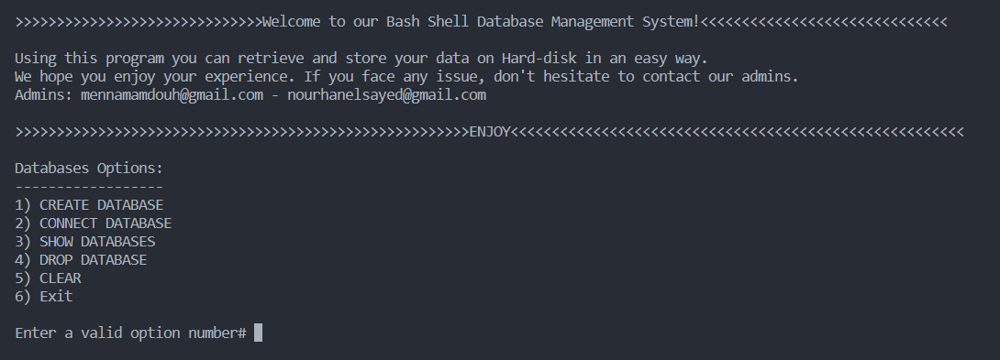

# Bash-Shell-Database-Management-System
Bash Shell Database Management System is a project that aims to develop a DBMS that will enable users to store and retrieve data from Hard-disk using a bash shell script.

Each created database or table is translated into a directory or a file respectively. It means that a database is just a directory which contains some files that represent all the tables in that database. Each table has 2 files, `table_name_META.txt` and `table_name.txt`. The `table_name_META.txt` file of a table contains information about the table's columns, their data types, and which column is the primary key. The `table_name.txt` file contains all the data inserted by the user.

## Project Overview ##

The repository has 4 files, `dbms-script.sh`, `main.sh`, `db-options.sh`, and `tb-options.sh`.

1. `dbms-script.sh` is the original file which we began with. It contains the whole code, all functionalities. After that we decided to separate the code into 3 files, `main.sh`, `db-options.sh`, and `tb-options.sh`.
2. `main.sh` is the file which contains the entry point of the porject.
3. `db-options` is the file which contains all the functionalities of the databases such as creating a database, list the existing databases, connecting to a database, dropping a database ... etc.
4. `tb-options` is the file which contains all the functionalities of the tables such as creating a table, updating or inserting data into a table, dropping a table ... etc.

---

## Project Functionalities ##

### <u>Database Options</u>: ###

*Using the application you can do some databases operations:*

- __Create a database__
    > Creating a directory in the `databases` directory which contains all the databases in the system.

- __Connect to an existing database__
  > Changing the working directory to the directory of the desired database.

- __List all existing databases__
  > List all the directories in the `databases` main directory.

- __Drop a database__
  > Removing the directory of the desired database.


### <u>Tables Options</u>: ###
*After connecting to a specific database, you can do some tables operations:*

- __Create a table__
  > Creating 2 files into the connected database's directory. One for the meta data of the table `table_name_META.txt`, and the other for the data itself `table_name.txt`.

- __Inserting data into a table__
  > Appending the input data to the intended file `table_name.txt`.

- __Retrieving data__
  > Printing all the contents of the file `table_name.txt`.

- __Drop a table__
  > Removing the 2 files that is related to that table.

- __Updating data__
  > Adjusting existing data with new data that is entered by the user after specifying the primary key of that data.

- __Deleting data__
  > Removing the targeted data from the table's file after specifying the primary key of that data.

- __Listing tables__
  > Listing all the files in the connected database.

### Extra Options ###

- __Clear__
  > Reseting the user interface that is shown to the user.

- __Disconnect__
  > Changing the working directory to the `databases` directory. This shows the database options to the user again.

- Exit
  > Just terminating the program

---

## How to run ##

First, you need to download the 3 files `main.sh`, `db-options.sh`, and `tb-options.sh` or you can download the `dbms-script.sh` file only.

Then, open any linux terminal such as `git bash` in the directory that contains the project's files and run the following command:
```bash
bash main.sh
```

Finally, you will get the main menu. Start using the program and enjoy!

<div align="center">
    
    <p><em>Bash Shell DBMS Project Menu</em></p>
</div>

---